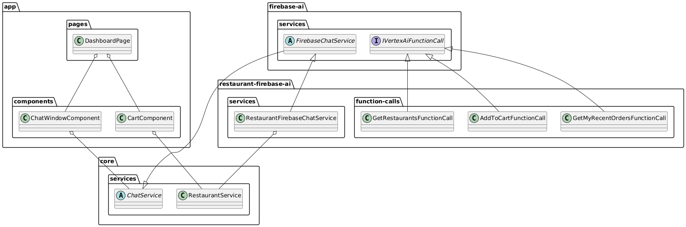

## Setup Steps
1. Download or clone this code.
1. Follow the steps here to setup a Firebase project and an app configuration: https://firebase.google.com/docs/ai-logic/get-started?platform=web&api=dev
1. Once Firebase is setup, you can copy the firebase config of your "app" and paste it into `src\environments\environment.ts`, or `environment.development.ts` in the same folder
    ```
   export const environment = {
      production: true,
      firebase: {
        apiKey: "",
        authDomain: "",
        projectId: "",
        storageBucket: "",
        messagingSenderId: "",
        appId: ""    
      },
    };
    ```
1. Run `npm install` to setup the project dependencies
1. Run `npm start` to run the project
1. In a command window of the project, navigate to `service-hungry-hungry-hip-ai\Restaurants.API` and run `dotnet run` 

## Design
Here is a class diagram depicting the original-intended design of the system.  This approach abstracts the usage of Firebase from the UI components, allowing us to potentially swap in a different vendor-solution:

